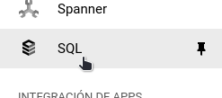
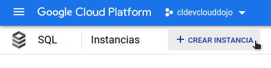
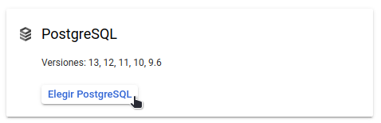
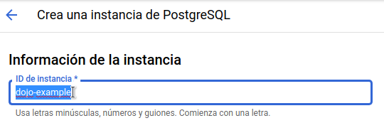
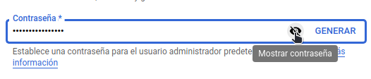
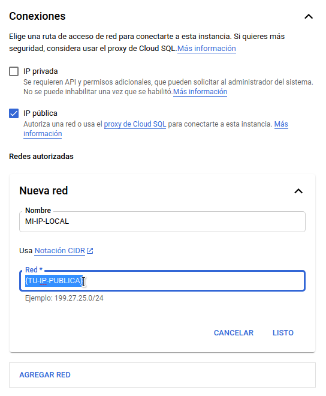
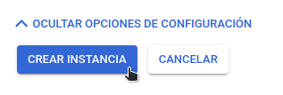
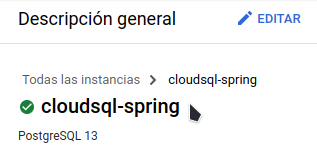
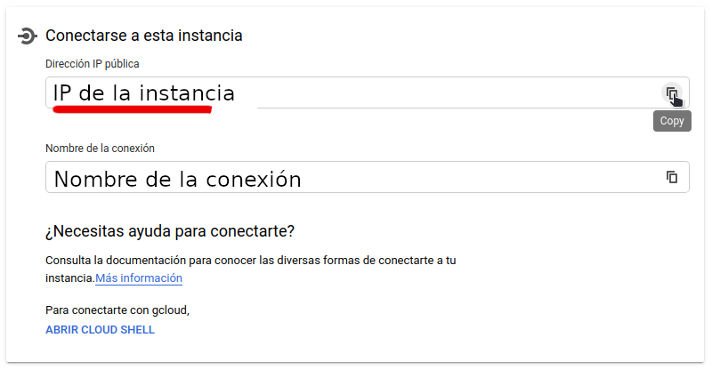

# Cloud Sql Demo

Este proyecto está enfocado en demostrar la conexion con CloudSql mediante una ip publica

## Prerequisitos

What things you need to install the software and how to install them
* Java 8
* [Gradle](https://gradle.org//) - Dependency Management
* [Lombok](https://projectlombok.org/setup/overview) - Java library

## Configuración inicial


### Creación de la instancia

Para ejecutar este proyecto es necesario crear una instancia Cloud Sql en GCP, para ello puedes hacerlo en la consola mediante la interfaz gráfica seleccionando SQL en el menú lateral izquierdo:



Luego selecciona “crear instancia” en la parte superior de la consola de GCP:



### Selección del motor de base de datos

Para aspectos de este DOJO te recomendamos seleccionar el motor de bases de datos Postgres:



### Configuración

Asigne un nombre de ID en la instancia a criterio personal:



Para generar una contraseña segura te recomendamos presionar la opción “GENERAR” y luego “Mostrar Contraseña” para guardarla en tu portapapeles:



### Configuración de conexión

Para poder acceder a nuestra base de datos, tenemos que configurar las conexiones como ip pública y en “Redes autorizadas” será necesario agregar nuestra ip publica y darle un nombre descriptivo:



En Linux, con “curl” previamente instalado, puedes conocer rápidamente tu ip pública con este comando:

```
curl ifconfig.me
```

### Finalización de la instancia

Una vez que hayas definido las configuraciones de acuerdo al caso de uso puedes finalizar presionando el siguiente botón:



Ahora debes esperar unos minutos hasta que la instancia se cree, una vez creada aparecerá un ícono verde en la descripción general como el siguiente:



En la misma ventana podrás revisar la ip de la base de datos para poder acceder a ella, el nombre de la base de datos por defecto es postgres y la clave es la que acabas de copiar en el portapapeles:



Para obtener mas información revisa el siguiente enlace: [CloudSql](https://cloud.google.com/sql/docs/mysql/connect-external-app#java)

#### Configuarcion de los properties

Antes de levantar tu proyecto tienes que preocuparte de asignar los valores correctos para la conexión con la base de datos, puedes hacerlo creando las siguientes variables de entorno en tu sistema operativo o simplemente reemplazando los valores en el archivo **src/main/resources/application.properties**:

```
spring.datasource.url=jdbc:postgresql://${IP_CLOUDSQL}:${PORT_CLOUDSQL}/postgres?useUnicode=true&characterEncoding=UTF-8&autoReconnect=true&zeroDateTimeBehavior=convertToNull&verifyServerCertificate=false&useSSL=false&requireSSL=false
spring.datasource.username=${USER_CLOUDSQL}
spring.datasource.password=${PASS_CLOUDSQL}
```

## Compilar y ejecutar este proyecto

Recuerda usar java 8 o mayor y ejecutar los siguientes comandos:

```
./gradlew clean build
```

Finalmente ejecuta el siguiente comando en la consola de su sistema operativo para ejecutar la aplicación:

```
export IP_CLOUDSQL={la ip de cloud sql}                             
export PASS_CLOUDSQL={la clave de la base de datos}
export PORT_CLOUDSQL=5432
export USER_CLOUDSQL={el usuario de la base de datos, por defecto es postgres}

./gradlew bootRun --args='--spring.profiles.active=local'
```

### API DOCS
* [Accessing local](http://localhost:8080/swagger-ui/#/pax-controller)


## Autores

* **Jorge Leiva** - *Initial work* - jorgeleiva.17@gmail.com
